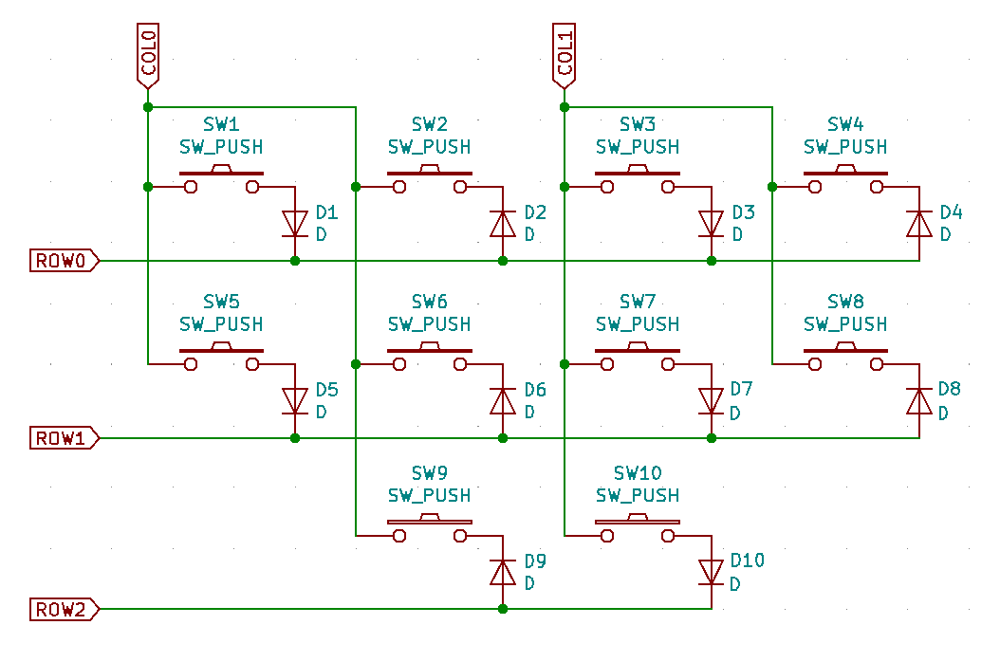

## Valid version

|Feature|Version|
|----|----|
|Normal matrix|0.9.0+|
|Duplex matrix|0.9.11+|
|Direct-scan matrix|0.9.9+|

## Normal matrix

```ruby
kbd = Keyboard.new
kbd.init_pins(
  [ 12, 11, 10, 9, 8 ], # row0, row1,... respectively
  [ 7, 6, 5, 4, 3, 2 ]  # col0, col1,... respectively
)
```

## Duplex matrix

When you have a circuit that the image shows:



You can configure pins in this way:

```ruby
# The actual pin numbers depend on your circuit
row0 = 1
row1 = 2
row2 = 3
col0 = 4
col1 = 5
# Init duplex matrix
kbd.init_matrix_pins(
  [
    [ [row0, col0], [col0, row0], [row0, col1], [col1, row0] ],
    [ [row1, col0], [col0, row1], [row1, col1], [col1, row1] ]
    [          nil, [col0, row2], [row2, col1],        nil ] ]
  ]
)
kbd.add_layer :default, %i(
  KC_1    KC_2     KC_3     KC_4
  KC_A    KC_B     KC_C     KC_D
  XXXXXXX KC_SPACE KC_ENTER XXXXXXX
)
```

In `Keyboard#init_matrix_pins`, put `nil` where an actual switch doesn't exist.
`XXXXXXX` should be put where the corresponding places in `Keyboard#add_layer`.
This convention is mainly to support split-type keyboard though, better to follow it even if using a non-split-type one for future compatibility.

### Relation between `init_pins` and `init_matrix_pins`

Following two codes are internally equivalent:

```ruby
kbd.init_pins(
  [ 1, 2 ],
  [ 3, 4 ]
)
```

```ruby
kbd.init_matrix_pins(
  [
    [ [1 ,3], [1 ,2] ],
    [ [2 ,3], [2, 4] ],
  ]
)
```

### Tell us if you have a Round-robin matrix

`Keyboard#init_matrix_pins` may cover also "Round-robin matrix" though, the dev team doesn't test on an actual keyboard yet.
Any feedback even it's working is welcome!

## Direct-scan matrix

```ruby
kbd.init_direct_pins(
  [ 8, 27, 28, 29, 9, 26 ]
)
```

Above code equivalent to:

```ruby
kbd.set_scan_mode = :direct
kbd.init_pins(
  [],
  [ 8, 27, 28, 29, 9, 26 ]
)
```
