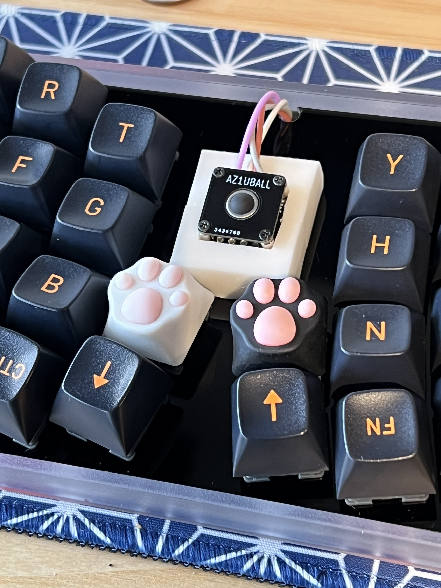
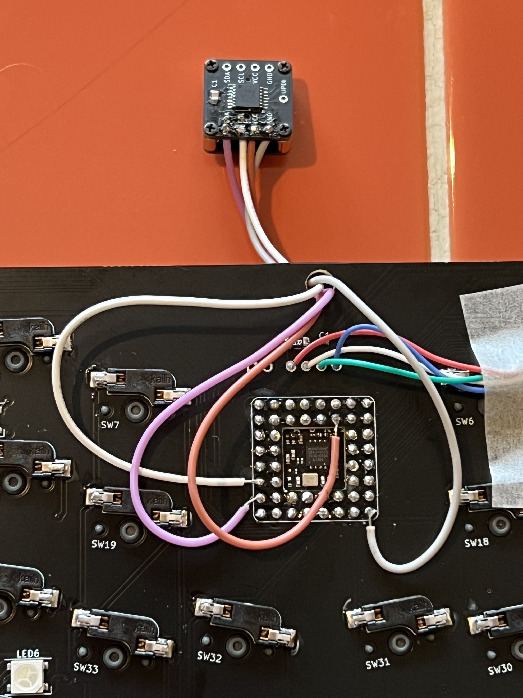
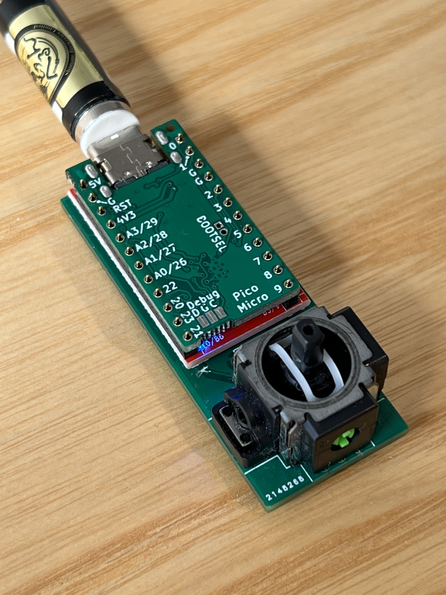
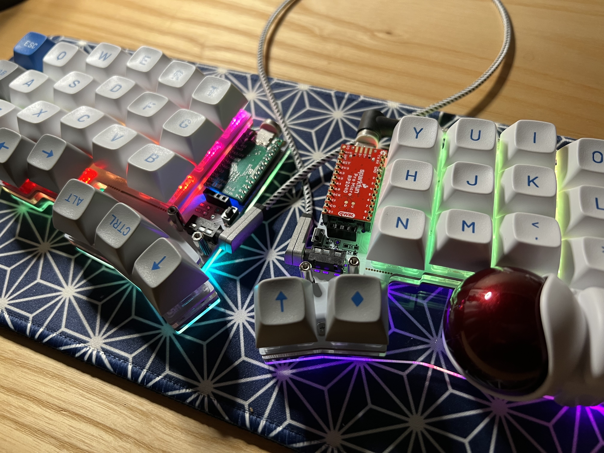

## Valid version

0.9.21+

## Description

`Mouse` class in PRK Firmware drives an HID mouse.
You can use various hardware such as Trackball, Pointing stick, Touchpad, and Joystick.
In order to do this, you need to write a bunch of low-level code by using one of the peripheral classes between `I2C`, `SPI` and `ADC`.

PicoRuby ecosystem doesn't support a specific 3rd party hardware in a form of a core library though, it is not such a difficult thing to write a mouse code (I wish you'll agree).

## Examples

### I2C

- Trackball: AZ1UBALL or PIM447




This example includes a tip of scroll wheels and validity checking of the bus.
You can use these techniques with SPI and ADC as well.

```ruby
require "i2c"
require "mouse"

# kbd.init_pins([1, 2], [...
# kbd.add_layer :default, %i[...

i2c = I2C.new(
  unit: :RP2040_I2C0,
  frequency: 100 * 1000,
  sda_pin: 20,
  scl_pin: 21
)

begin
  # 0x0a is the I2C address of AZ1UBALL (PIM447)
  i2c.write(0x0a, 0x91) # Set accelerated mode
  # This is also for checking I2C bus itself
  i2c_valid = true
rescue => e # i2c.write will raise if it doesn't work
  puts e, e.message
  puts "No valid I2C mouse found"
  i2c_valid = false
end

if i2c_valid
  mouse = Mouse.new(driver: i2c)
  mouse.task do |mouse, keyboard|
    left, x, up, y, push = mouse.driver.read(0x0a, 5).bytes
    x = -left if 0 < left
    y = -up if 0 < up
    # LEFT: 0b001, RIGHT: 0b010, MIDDLE: 0b100
    button = (push == 128 ? 0b100 : 0)
    if keyboard.layer == :default
      # 4x speed if the value is larger than 3
      3 < x.abs ? x *= 4 : x *= 2
      3 < y.abs ? y *= 4 : y *= 2
      USB.merge_mouse_report(button, x, y, 0, 0)
    else
      # Works as a scroll wheel when layer is changed
      USB.merge_mouse_report(button, 0, 0, x, -y)
    end
  end
  kbd.append mouse
end

kbd.start!
```

### ADC

- Joystick: RKJXV122400R



```ruby
require "adc"
require "mouse"

kbd = Keyboard.new

# kbd.init_pins([1, 2], [...
# kbd.add_layer :default, %i[...

adc_x = ADC.new(26)
adc_y = ADC.new(27)

# Adjust center offset
x_offset = 0
y_offset = 0
3.times do
  sleep_ms 20
  x_offset += adc_x.read
  y_offset += adc_y.read
end
x_offset /= 3
y_offset /= 3

mouse = Mouse.new(driver: [adc_x, adc_y])

mouse.task do |mouse|
  # Note: `driver.map(&:read)` doesn't work in PicoRuby yet
  x, y = mouse.driver.map { |adc| adc.read }
  x -= x_offset
  y -= y_offset
  USB.merge_mouse_report(0,
                         # Ignore less than 300 to avoid drifting and
                         # clamp the absolute value devided by 100 within 100
                         x.abs < 300 ? 0 : (x /  100).clamp(-100, 100),
                         y.abs < 300 ? 0 : (y / -100).clamp(-100, 100),
                         0,
                         0)
end

kbd.append mouse

kbd.start!
```

### SPI

- Sensor: PWM3360DM-T2QU on Keyball44



This complicated example realizes to:
- Change the keymap layer to `:mouse` and lock when you roll the trackball some amount
- Unlock the `:mouse` layer if you didn't touch the trackball for some time
- Change the trackball to a scroll wheel when you hold `:lower` layer key
- Make the cursor speed constant when you hold "Alt" key
- Restrict the cursor to move horizontally or vertically when you hold "Shift" key

```ruby
require "spi"
require "mouse"

kbd = Keyboard.new

# Ruby is so good that you can define your method in keymap.rb
class SPI
  def pmw3360dm_write(*values)
    GPIO.write_at(21, 0)
    write(*values)
    Machine.delay_us 20
    GPIO.write_at(21, 1)
  end
end

# Keyball44 has a circuit to check whether this half is LEFT or RIGHT
col0_pin = 4
row3_pin = 26
row3 = GPIO.new(row3_pin, GPIO::IN|GPIO::PULL_DOWN)
col0 = GPIO.new(col0_pin, GPIO::OUT)

col0.write(1)

if row3.high?
  # This half doesn't have a ball
else
  # Track ball is here!
  spi = SPI.new(
    unit: :RP2040_SPI0,
    frequency: 2_000_000,
    sck_pin:  22,
    cipo_pin: 20,
    copi_pin: 23,
    mode: 3
  )
  GPIO.new(21, GPIO::OUT)
  GPIO.write_at(21, 1)
  sleep_ms(50)
  begin
    # Power_Up_Reset
    spi.pmw3360dm_write(0x3A, 0x5A)
    sleep_ms(50)
    # Read and discard 0x02..0x06 registers
    [0x02, 0x03, 0x04, 0x05, 0x06].each do |reg|
      GPIO.write_at(21, 0)
      spi.write reg
      Machine.delay_us 35
      spi.read 1 # read and discard
      Machine.delay_us 20
      GPIO.write_at(21, 1)
    end
    sleep_ms(10)
    # Set CPI
    cpi = 200
    spi.pmw3360dm_write(0x0F|0x80, (cpi / 100) - 1)
    sleep_ms(10)
    # Set burst mode
    spi.pmw3360dm_write(0x50|0x80, 0)
    spi_valid = true
  rescue => e
    puts e, e.message
    spi_valid = false
  end
  if spi_valid
    mouse = Mouse.new(driver: spi)
    ball_move = 0
    mouse.task do |mouse, keyboard|
      GPIO.write_at(21, 0)
      mouse.driver.write(0x50)
      Machine.delay_us 35
      motion, _o, x_l, x_h, y_l, y_h = mouse.driver.read(6).bytes
      GPIO.write_at(21, 1)
      if (0 != motion & 0b10000000)
        x = x_h<<8|x_l
        y = y_h<<8|y_l
        x = -((~x & 0xffff) + 1) if 0x7FFF < x
        y = -((~y & 0xffff) + 1) if 0x7FFF < y
        if keyboard.layer == :lower
          x = 0 < x ? 1 : (x < 0 ? -1 : x)
          y = 0 < y ? 1 : (y < 0 ? -1 : y)
          USB.merge_mouse_report(0, 0, 0, y, -x)
        else
          if ball_move < 50
            ball_move += 7
            if 50 <= ball_move && keyboard.layer == :default
              keyboard.lock_layer :mouse
            end
          end
          if 0 < keyboard.modifier & 0b00100010
            # Shift key pressed -> Horizontal or Vertical only
            x.abs < y.abs ? x = 0 : y = 0
          end
          if 0 < keyboard.modifier & 0b01000100
            # Alt key pressed -> Fix the move amount
            x = 0 < x ? 2 : (x < 0 ? -2 : x)
            y = 0 < y ? 2 : (y < 0 ? -2 : y)
          end
          USB.merge_mouse_report(0, y, x, 0, 0)
        end
      else
        if 0 < ball_move && !mouse.button_pressed?
          ball_move -= 1
          keyboard.unlock_layer if ball_move == 0
        end
      end
      # This is to avoid LED's undesirable flicker.
      # Value may change on your keyboard
      sleep_ms 10
    end
    kbd.append mouse
    # Start Burst Motion reading
    spi.write(0x50)
  end
end

col0.write(0)

# kbd.init_pins(
#   [ 29, 28, 27, row3_pin ],
#   [ col0_pin, 5, 6, 7, 8, 9 ]
# )
# kbd.add_layer :default, %i[...
# kbd.add_layer :mouse, %i[...

kbd.start!
```

### Software (Bitbang) SPI

You can also configure a software SPI. See the example keymap.rb of [picoruby/prk_cocot46](https://github.com/picoruby/prk_cocot46plus)

## Split-type

A keyboard, that is a split-type along with I2C, SPI, or ADC peripheral device, won't work if the peripheral is on the *partner* half.

See also [[Split-type keyboard]].

## About pin assign

RP2040 has some restrictions on assigning a pin to a specific peripheral.
For example, if you want to use the ADC feature, you must choose one (or several) from GPIO 26, 27, 28, and 29.
I2C and SPI also have similar limitations.
See the document of RP2040 for details.

## Keycodes

Configure mouse keys in your keymap through `Keyboard#add_layer`.
See [[Layers and mode key]]

Generally, "Button 1" and "Button 2" should work as "left click" and "right click" respectively.

| Symbol          | Alias    | Description |
|----             |----      |----|
| :KC_MS_UP       | :KC_MS_U | Cursor up |
| :KC_MS_DOWN     | :KC_MS_D | Cursor down |
| :KC_MS_LEFT     | :KC_MS_L | Cursor left |
| :KC_MS_RIGHT    | :KC_MS_R | Cursor right |
| :KC_MS_BTN1     | :KC_BTN1 | Button 1 |
| :KC_MS_BTN2     | :KC_BTN2 | Button 2 |
| :KC_MS_BTN3     | :KC_BTN3 | Button 3 |
| :KC_MS_BTN4     | :KC_BTN4 | Button 4 |
| :KC_MS_BTN5     | :KC_BTN5 | Button 5 |
| :KC_MS_WH_UP    | :KC_WH_U | Wheel up |
| :KC_MS_WH_DOWN  | :KC_WH_D | Wheel down |
| :KC_MS_WH_LEFT  | :KC_WH_L | Wheel left |
| :KC_MS_WH_RIGHT | :KC_WH_R | Wheel right |

