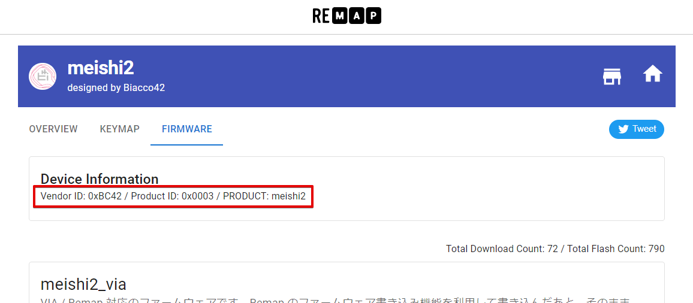
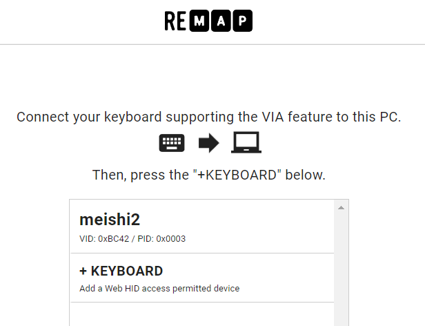
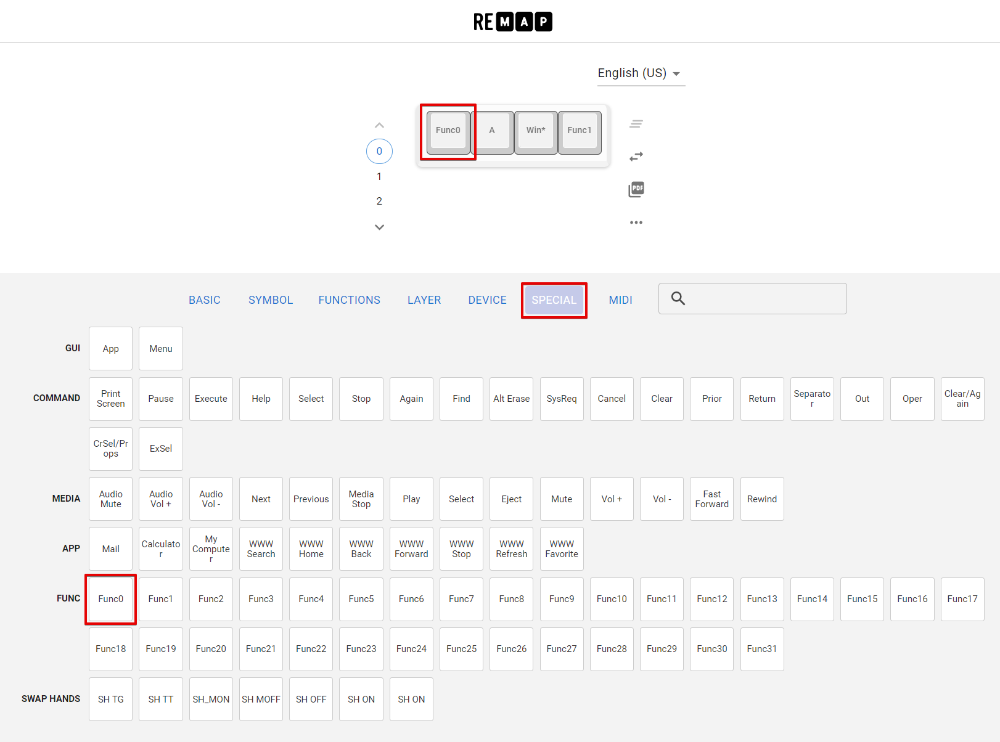

## Valid version

0.9.14+

## Notice

- The desktop app of VIA (https://github.com/the-via/releases/releases) doesn't recognize an individual keyboard which runs on PRK Firmware. Please use Remap (https://remap-keys.app/) instead
- Also, not all the features which Remap supports work on PRK-VIA
- For some reason, updating `keymap.rb` sometimes removes `via_map.txt`. In order not to be frustrated,
  - Read this page carefully
  - Don't try to finish all the settings at once, backup `via_map.txt` often

It'd be great if we can find a good way to share `keymap.rb` and `prk-conf.txt` because VIA is likely used by people who are not knowledgeable about programming than people who prefer writing their keymap with a text editor.

Let us hear your opinion to make a better ecosystem.

## Basic usage

### keymap.rb

Let's configure [meishi2](https://github.com/picoruby/prk_meishi2) for example.

This is the minimum content of `keymap.rb` to use the VIA feature:

```ruby
require "via"

kbd = Keyboard.new

# This should happen before `kbd.init_pins`
kbd.via = true

kbd.via_layer_count = 1

kbd.init_pins(
  [ 6, 7 ],   # row0, row1
  [ 28, 27 ]  # col0, col1
)

kbd.start!
```

Don't forget writing `require "via"` at the top of the script.
It loads the VIA module that makes `Keyboard#via=` available.

### prk-conf.txt

You need to prepare `prk-conf.txt` so that Remap can recognize a specific keyboard.

The format of the content is `[Vendor ID]:[Product ID]:[PRODUCT]`.

You can get those values in the Remap's catalog page of meishi2 for example:

[https://remap-keys.app/catalog/756NcK1aaYMm9CuJhcTA/firmware](https://remap-keys.app/catalog/756NcK1aaYMm9CuJhcTA/firmware)



Copy the values of "Vendor ID", "Product ID" and "PRODUCT" and paste them at the very top of `prk-conf.txt` in the format below:

```
0xBC42:0x0003:meishi2
```

Note that this line must NOT include any other letter except a line feed.

Eventually, your "PRK DRIVE" drive should look like this:

```
PRK DRIVE
├── keymap.rb
├── prk-conf.txt
└── via_map.txt  # This is going to show after configuring on Remap
```

### Reboot

Rebooting the microcontroller applies `prk-conf.txt`.

### Remap

The configure page of Remap ([https://remap-keys.app/configure](https://remap-keys.app/configure)) will identify your keyboard. Enjoy!



## Backup your files (optional but strongly recommended)

It is recommended to save a copy of `keymap.rb`, `prk-conf.txt` and `via_map.txt` (automatically created by configuring a keymap in Remap then you can obtain the latest one after one more rebooting the board) on your local PC because upgrading PRK Firmware is going to remove them.

If you have those three files, you no longer need even Remap the next time. Just dragging and dropping them into "PRK DRIVE" drive restores your keymap (unless there is any breaking change in the new PRK Firmware🤞).

## Layer

### keymap.rb

Let's say you are making three layers in your keyboard.
You need to define *mode-keys* in `keymap.rb` **in advance of connecting to Remap** as the code shows.

```ruby
kbd.via_layer_count = 3
kbd.define_mode_key :VIA_FUNC1, [ :KC_SPACE, :VIA_LAYER1, 200, 200 ]
kbd.define_mode_key :VIA_FUNC2, [ :KC_ENTER, :VIA_LAYER2, 200, 200 ]
```

Note that it is `VIA#define_mode_key`, NOT `Keyboard#define_mode_key`, but their API design is almost the same.
See [[Layers-and-mode-key]] for more information about mode-key.

In this example, each *mode-key* works as the table describes:

| Key      | Tap to input | Hold to change layer |
|----------|--------------|----------------------|
|:VIA_FUNC1| :KC_SPACE    | Change to LAYER1     |
|:VIA_FUNC2| :KC_ENTER    | Change to LAYER2     |

### Remap

Unlike traditional VIA, PRK requires "Func" keys to configure layers.

The image below shows how you can find and configure a "Func" key in Remap:



## RGB keys

These keys can be configured through Remap (DEVICE > UNDERGLOW section):

|Keyname in Remap|Keycode in PRK|
|:--------------:|:------------:|
|RGB Toggle      |:RGB_TOG      |
|RGB Mode+       |:RGB_MOD      |
|RGB Mode-       |:RGB_RMO      |
|Hue+            |:RGB_HUI      |
|Hue-            |:RGB_HUD      |
|Sat+            |:RGB_SAI      |
|Sat-            |:RGB_SAD      |
|Bright+         |:RGB_VAI      |
|Bright-         |:RGB_VAD      |
|Effect Speed+   |:RGB_SPI      |
|Effect Speed+   |:RGB_SPD      |

## Rotary encoder

As of 0.9.14, rotary encoders can't be configured through Remap. Write in `keymap.rb` instead.
See [[Rotary encoder]]

## Media keys etc.

As of 0.9.14, features that PRK doesn't support like media keys and mouse buttons wouldn't work even if they look available on Remap.

