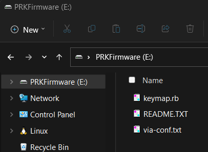

## Valid version

0.9.14+

The VIA feature of PRK doesn't work with the desktop app of VIA (https://github.com/the-via/releases/releases).
Please use Remap instead.

## Basic usage

### keymap.rb

Let's configure [meishi2](https://github.com/picoruby/prk_meishi2) for example.

This is the minimum content of `keymap.rb` to use the VIA feature:

```ruby
require "via"

kbd = Keyboard.new

kbd.init_pins(
  [ 6, 7 ],   # row0, row1
  [ 28, 27 ]  # col0, col1
)

via = VIA.new
via.rows_size = 2
via.cols_size = 2
via.layer_count = 1

kbd.append via

kbd.start!
```

Don't forget writing `require "via"` at the top of the script.
It loads the VIA module that makes `VIA.new` available.

### via-conf.txt

You need to prepare `via-conf.txt` so that Remap can recognize a specific keyboard.

The format of the content is `[Vendor ID]:[Product ID]:[PRODUCT]`.

You can get those values in the Remap's catalog page of meishi2 for example:

[https://remap-keys.app/catalog/756NcK1aaYMm9CuJhcTA/firmware](https://remap-keys.app/catalog/756NcK1aaYMm9CuJhcTA/firmware)


Copy the values of "Vendor ID", "Product ID" and "PRODUCT" and paste them into `via-conf.txt` as below:

```
0xBC42:0x0003:meishi2
```

Note that the file must NOT include any other letter.

Eventually, your "PRKFirmware" drive should look like this:



### Reboot

Rebooting the microcontroller applies `via-conf.txt`.

### Remap

The configure page of Remap ([https://remap-keys.app/configure](https://remap-keys.app/configure)) will identify your keyboard. Enjoy!


## Backup your files (optional)

It is recommended to save a copy of `keymap.rb`, `via-conf.txt` and `via_map.rb` (automatically created by configuring a keymap in Remap then you can obtain the latest one after one more rebooting the board) on your local PC because upgrading PRK Firmware is going to remove them.

If you have those three files, you no longer need even Remap the next time. Just dragging and dropping them into "PRKFirmware" drive restores your keymap.

## Layer

Let's say you are making three layers in your keyboard.
You need to define *mode-keys* in `keymap.rb` in advance as the code shows.

```ruby
via.layer_count = 3
via.define_mode_key :VIA_FUNC0, [ :KC_SPACE, :VIA_LAYER1, 200, 200 ]
via.define_mode_key :VIA_FUNC1, [ :KC_ENTER, :VIA_LAYER2, 200, 200 ]
```

Note that it is `VIA#define_mode_key`, NOT `Keyboard#define_mode_key`, but their API design is almost the same.
See [[Layers-and-mode-key]] for more information about mode-key.

| Key | Tap to input | Hold to change layer |
|-----|--------------|----------------------|
|FUNC0| :KC_SPACE    | Change to LAYER1     |
|FUNC1| :KC_ENTER    | Change to LAYER2     |

In Remap, put "FUNC0" and "FUNC1" where you want.


## Split-type keyboard

As of 0.9.14, VIA feature doesn't work on a split-type keyboard.

## Rotary encoder

As of 0.9.14, rotary encoders can't be configured through Remap. Write in `keymap.rb` instead.

## Media keys etc.

As of 0.9.14, features that PRK doesn't support like media keys and mouse buttons wouldn't work even if they look available on Remap.

